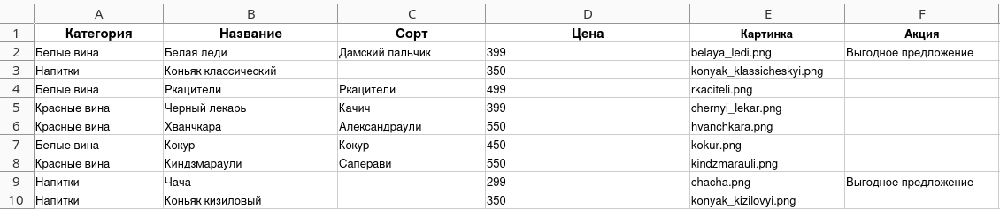

# Новое русское вино

Сайт магазина авторского вина "Новое русское вино".

## Установка

- Скачайте код:
```shell
git clone https://github.com/K-Mickey/devman_web_wine.git
```
- Перейдите в директорию проекта и создайте виртуальное окружение:
```shell
python -m venv venv
```
- Активируйте виртуальное окружение. В разных операционных системах это делается по разному:
  - Windows: `.\venv\Scripts\activate`
  - MacOS/Linux: `source venv/bin/activate`
- Установите зависимости в виртуальное окружение:
```shell
pip install -r requirements.txt
```
- Определите переменные окружения. Используйте `.env.example` или создайте свой файл `.env` в корневой директории проекта. Нужные переменные:
  - `WINE_PATH` - путь к XLSX файлу с винами (обязательный)
  - `LOG_LEVEL` - уровень логирования

  Пример файла:
  ```
  WINE_PATH=wine.xlsx
  LOG_LEVEL=INFO
  ```

### Пример XLSX файла
Описание содержания:
- **Категория** - _'Белые вина'_ / _'Красные вина'_ / _'Напитки'_...
- **Название** - Название напитка
- **Сорт** - Сорт винограда. Остаётся пустым для напитков
- **Цена** - Цена напитка в рублях
- **Картинка** - Название соответствующего изображения, которое находится в 'images/'
- **Акция** - Для активации вставьте в это поле 'Выгодное предложение'


## Запуск

- Запустите сайт командой `python3 main.py`
- Перейдите на сайт по адресу [http://127.0.0.1:8000](http://127.0.0.1:8000).

## Цели проекта

Код написан в учебных целях — это урок в курсе по Python и веб-разработке на сайте [Devman](https://dvmn.org).
